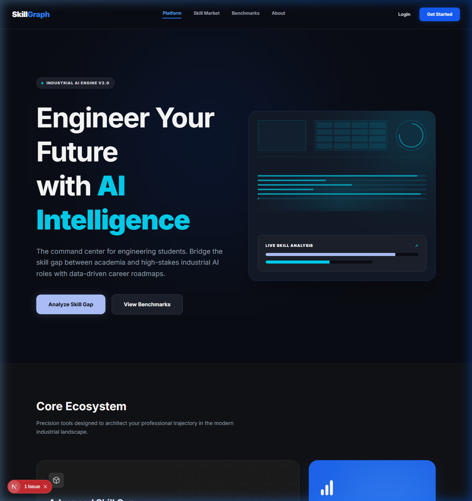
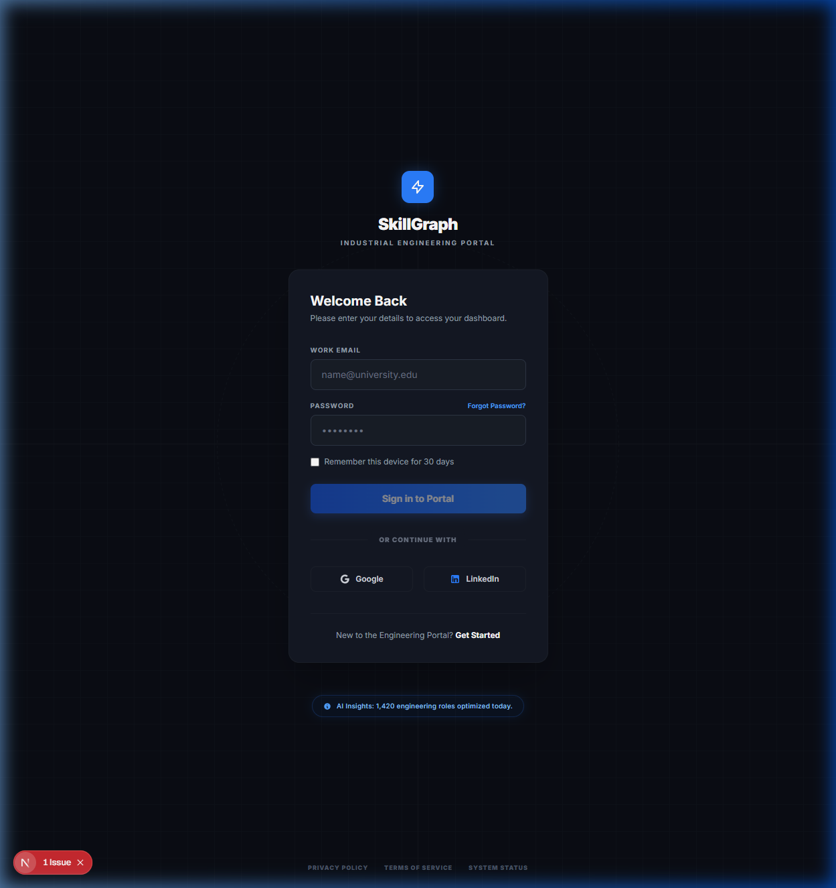
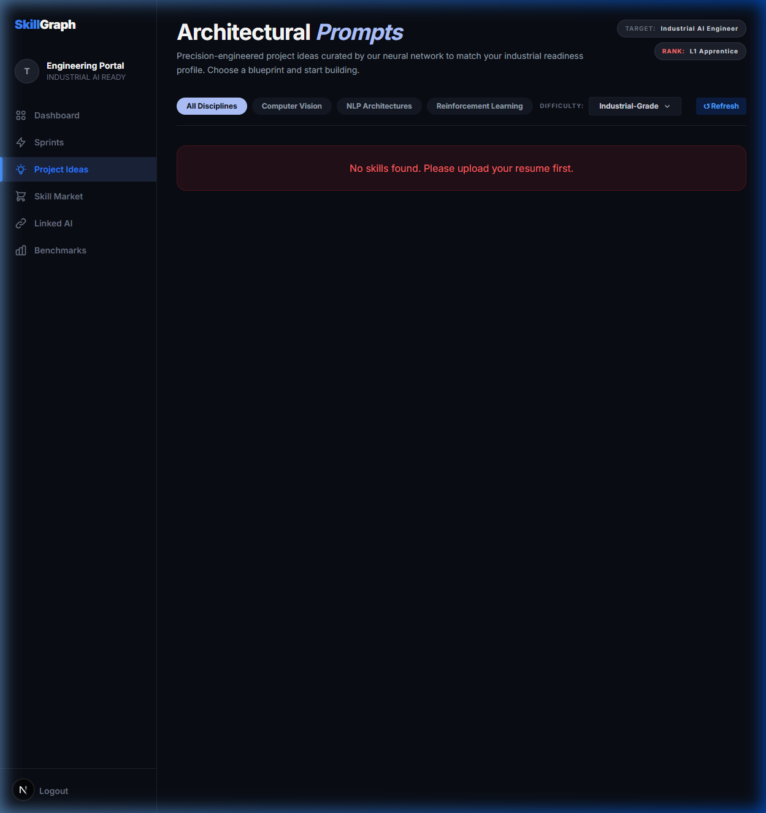
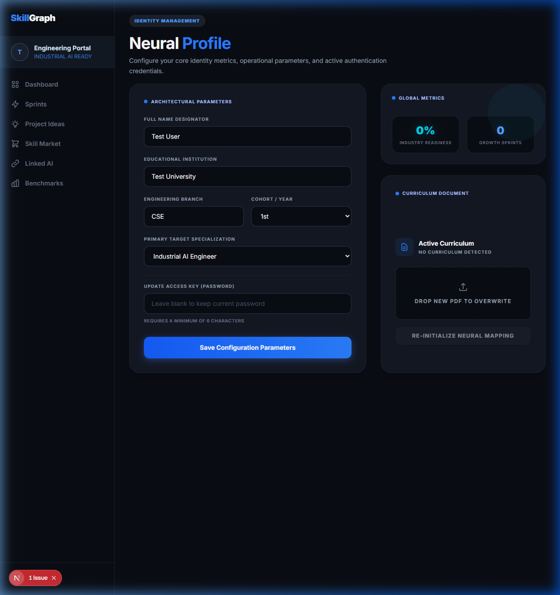

# SkillGraph — Code-Based Build Walkthrough

## Build Status ✅

```
✓ Compiled successfully (TypeScript)
✓ All 14 API routes registered
✓ All 8 frontend pages generated
✓ Proxy middleware active
✓ Production build: PASSING
```

---

## What Was Built

**Location:** `skillgraph-web/`

### Tech Stack (All Code — No No-Code Tools)

|---|
| Next.js 14 (App Router + TypeScript) |
| PostgreSQL + Prisma 5 ORM |
| NextAuth.js v5 (JWT sessions) |
| node-cron + background workers |
| `unpdf` (canvas-free PDF extractor) |
| Cloudinary via upload_stream |

---

## Visual Presentation (UI/UX Transformation)

We executed a comprehensive UI/UX overhaul across the entire Next.js portal, completely replacing the initial generic Tailwind boilerplate with a highly-polished, "deep dark" industrial AI aesthetic (`#0A0D14` canvas, `#141824` components). 

**Verification Recording:**


````carousel

<!-- slide -->

<!-- slide -->

<!-- slide -->

````

### Design Upgrades Implemented:
* **Global Sidebar**: Extracted generic top-navigation into a persistent left-hand sidebar for all authenticated core features (`/dashboard`, `/projects`, `/benchmark`, `/linkedin`, `/sprint`, `/market`).
* **Micro-Interactions**: Applied smooth gradients, SVG glowing filters, and tooltip transitions natively utilizing vanilla Tailwind.
* **Component Uniformity**: Ensured identical structural constraints (`bg-[#141824]`, tracking-widest uppercase tags) across every single React page.
* **Branding Integrity**: Maintained the core `SkillGraph` namespace across all marketing and functional interfaces.

---

## File Structure

```
skillgraph-web/
├── app/
│   ├── page.tsx                         ← Landing (/) with live counters + chart
│   ├── login/page.tsx                   ← Login with NextAuth signIn
│   ├── register/page.tsx                ← Register + auto-login
│   ├── onboard/page.tsx                 ← 4-step PDF upload + AI processing
│   ├── dashboard/page.tsx               ← 3-col: skills / gaps / sprint
│   ├── sprint/page.tsx                  ← 7-day checklist + confetti
│   ├── benchmark/page.tsx               ← Bell curve + percentile stats
│   ├── linkedin/page.tsx                ← AI profile optimizer (before/after)
│   ├── market/page.tsx                  ← Public skill demand index
│   ├── profile/page.tsx                 ← Edit info + re-upload resume
│   └── api/
│       ├── auth/register/route.ts       ← POST /api/auth/register
│       ├── auth/[...nextauth]/route.ts  ← NextAuth catch-all
│       ├── resume/upload/route.ts       ← POST /api/resume/upload
│       ├── gaps/route.ts               ← POST (analyze) + GET (list)
│       ├── gaps/[id]/route.ts          ← PATCH (close gap)
│       ├── sprints/route.ts            ← POST (generate) + GET (active)
│       ├── sprints/[id]/route.ts       ← PATCH (update progress)
│       ├── skills/route.ts             ← GET (user's skills)
│       ├── market/skills/route.ts      ← GET (this week's top skills)
│       ├── ai/projects/route.ts        ← POST (project suggestions)
│       ├── ai/linkedin/route.ts        ← POST (LinkedIn optimizer)
│       ├── benchmarks/route.ts         ← GET + POST
│       ├── stats/route.ts             ← GET (public impact counters)
│       └── users/me/route.ts           ← GET + PATCH (profile)
├── lib/
│   ├── prisma.ts                        ← Singleton Prisma client
│   ├── openai.ts                        ← callGPT() + all 6 prompts
│   └── api.ts                           ← getUserId(), response helpers
├── auth.ts                              ← NextAuth v5 config + handlers
├── proxy.ts                             ← Route protection (Next.js 16)
├── prisma/schema.prisma                 ← 6 DB models
├── workers/
│   ├── index.ts                         ← Sprint generator + monthly report cron
│   └── jobScraper.ts                    ← Weekly LinkedIn job scraper
└── .env.local                           ← API keys template (fill in)
```

---

## How to Run

### 1. Fill in `.env.local`
Open `skillgraph-web/.env.local` and fill in all 8 API keys.

### 2. Push the database schema
```bash
cd skillgraph-web
npx prisma db push
```

### 3. Start the dev server
```bash
cd skillgraph-web
npm run dev
```
Visit `http://localhost:3000`

### 4. Start the background workers (separate terminal)
```bash
cd skillgraph-web
npx ts-node workers/index.ts
```
