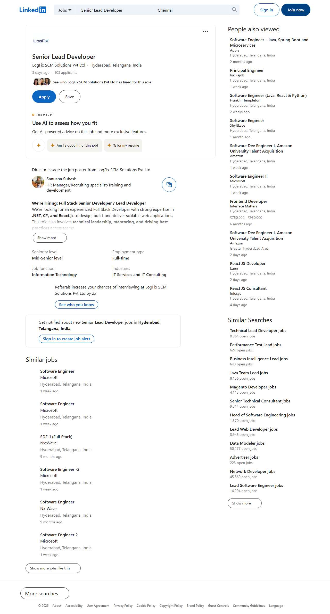
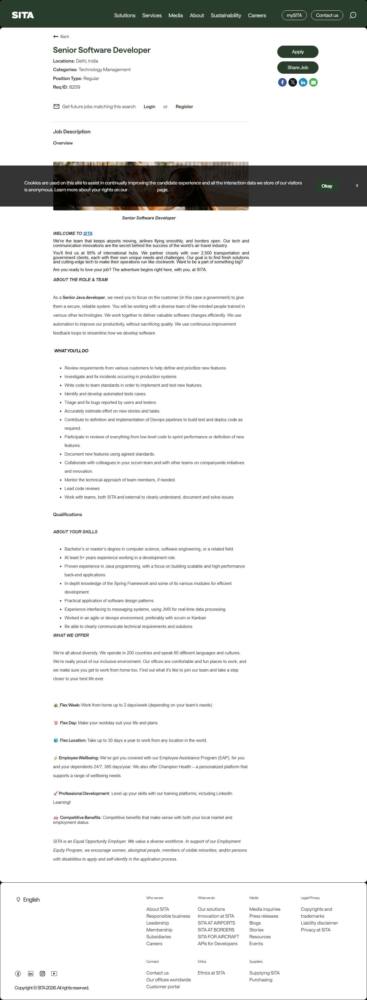
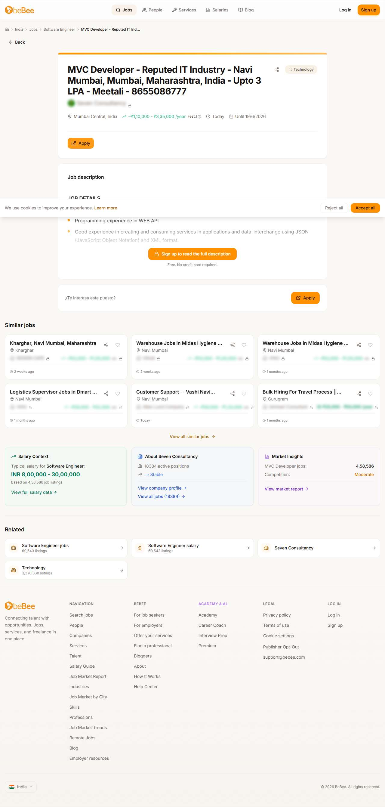

# SkillGraph: Autonomous Career Orchestration Platform

<p align="center">
  
</p>

## Project Status ⚡


SkillGraph is an end-to-end AI career mentor and autonomous application agent. It transforms the job search from a manual grind into a persistent, authenticated technical mission through robotic process automation and high-fidelity project-based learning.

---

## 🚀 Production-Grade Features (v2.5)

### 1. Multi-Platform CareerOps (OpenClaw)
The platform now supports **Authenticated Autonomous Applications**. 
- **Platform-Aware Auth**: Link separate persistent sessions for **LinkedIn, Glassdoor, Indeed, and Naukri**. The bot uses your real identity to apply directly.
- **Real-Time Status Synchronization**: A dedicated `Syncer` service periodically revisits applications to track status changes (Shortlisted, Viewed, Rejected) live on your dashboard.
- **Automated Interaction Proofs**: Every application generates a persistent visual record of the interaction in `public/proofs/`.

### 2. Symmetric High-Fidelity Resume Engine
- **Professional Aesthetic**: Centered, blue-themed, ATS-optimized layout with symmetric exports across OpenClaw (auto) and Resume Builder (manual).
- **Dynamic Tailoring**: Roles, projects, and achievements are automatically formatted from your profile and tailored to specific job descriptions using LLM context.
- **Profile Enriched**: Automatically injects verified CGPA, LinkedIn, Github, and project impact metrics.

### 3. Topic-Aware Dynamic Sprints
- **Mission Overrides**: Don't like your current 7-day sprint? Click **Refactor** to pivot your focus to specific topics (e.g., "System Design", "Rust Internals").
- **Learning Resilience**: Integrated **YouTube Primary/Search fallbacks** ensure that educational resources are always accessible even if search indexes shift.

---

## 🛠️ Technology Stack & Architecture

- **Frontend**: Next.js 16 (App Router), Tailwind CSS, Framer Motion
- **Database**: PostgreSQL with Prisma ORM
- **Automation Engine**: Playwright (Authenticated State Persistence)
- **AI Orhcestration**: GPT-4o / Llama 3.3 (Learning & Strategy)
- **File Management**: Cloudinary (Resume Hosting)

### File Structure Overview
```text
skillgraph-web/
├── app/(app)/sprint/           ← Target: Custom Topic Regeneration
├── app/api/openclaw/            ← Orchestration: Multi-Platform Auth & Sync
├── components/openclaw/         ← Dashboard: CareerOps Control Center
├── lib/openclaw/agent.ts        ← Logic: Authenticated Applicator Bot
├── lib/openclaw/syncer.ts       ← Service: Automated Status Tracking
└── lib/resume/exporter.tsx      ← Engine: High-Fidelity PDF Generation
```

---

## 📂 Visual Proof of Work
<div align="center">
  
  
</div>

---

## 🔨 How to Run locally

### 1. Configure the Environment
Clone the repository and inject your configurations inside `skillgraph-web/.env.local` (OpenAI, Cloudinary, Database URLs).

### 2. Physical Database Sync
Initialize PostgreSQL and align the Prisma schema definitions locally:
```bash
cd skillgraph-web
npx prisma db push
```

### 3. Initiate the Dev Server
```bash
npm run dev
```
Navigate to `http://localhost:3000`.

### 4. CareerOps Background Service
```bash
npx ts-node lib/openclaw/syncer.ts
```

---
<p align="center">
  Created with ♥ by ftaakash — SkillGraph v2.5 Stable
</p>
