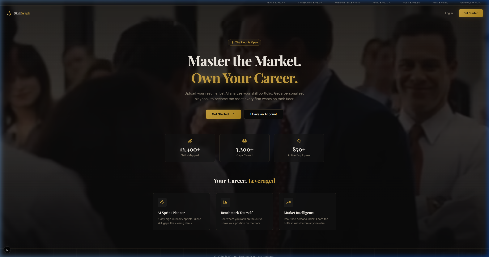
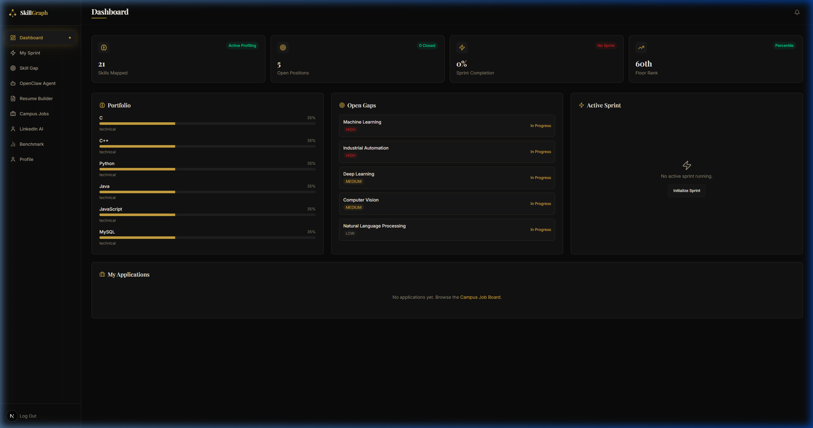
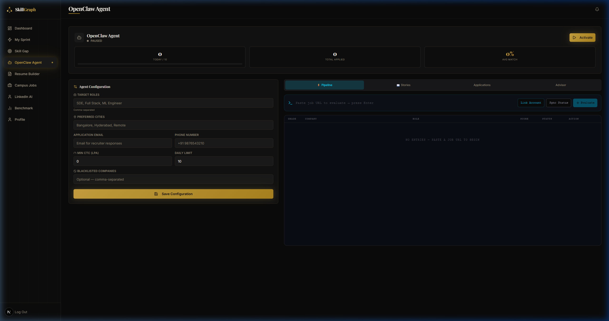
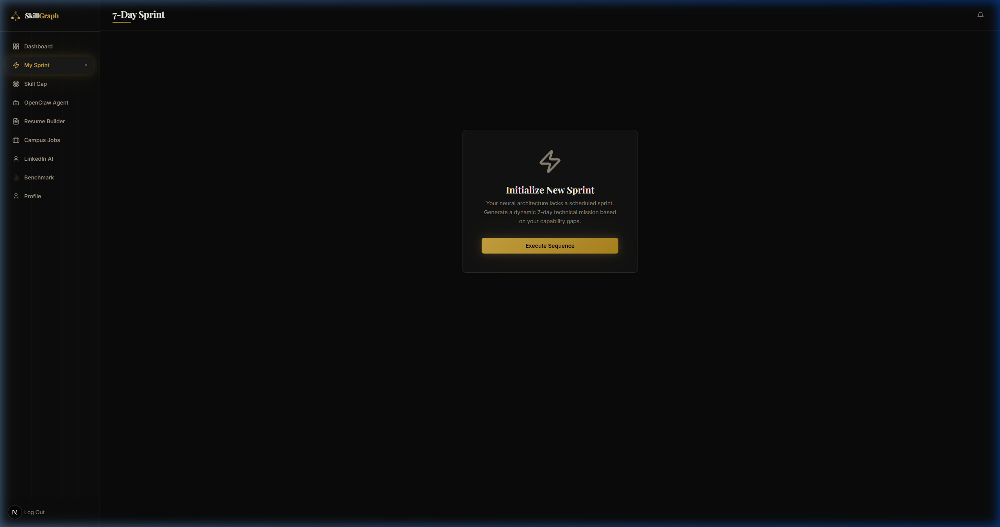

# SkillGraph: Autonomous Career Orchestration Platform

<p align="center">
  
</p>

## Project Status ⚡


SkillGraph is an end-to-end AI career mentor and autonomous application agent. It transforms the job search from a manual grind into a persistent, authenticated technical mission through robotic process automation and high-fidelity project-based learning.

---

## 🚀 Production-Grade Features (v2.5)

### 1. Multi-Platform CareerOps (OpenClaw)
The platform now supports **Authenticated Autonomous Applications**. 
- **Platform-Aware Auth**: Link separate persistent sessions for **LinkedIn, Glassdoor, Indeed, and Naukri**.
- **Real-Time Status Synchronization**: A dedicated `Syncer` service tracks application status changes live.

### 2. Symmetric High-Fidelity Resume Engine
- **Professional Aesthetic**: Symmetric exports across automated agent and manual Resume Builder.
- **Dynamic Tailoring**: Roles and achievements are tailored to job descriptions using LLM context.

### 3. Topic-Aware Dynamic Sprints
- **Mission Overrides**: Pivot focus to specific topics (e.g., "System Design") on the fly.
- **Learning Resilience**: Integrated YouTube fallbacks ensure resources are always available.

---

## 🛠️ Technology Stack & Architecture

- **Frontend**: Next.js 16 (App Router), Tailwind CSS
- **Database**: PostgreSQL with Prisma ORM
- **Automation**: Playwright (Authenticated State)
- **AI Orhcestration**: GPT-4o / Llama 3.3

---

## 📂 Platform Gallery

### 🖥️ Main Interfaces
<p align="center">
  
  
</p>

### 🎯 Skill Development
<p align="center">
  
</p>

---

## 🔨 How to Run locally

### 1. Configure the Environment
Clone the repository and inject your configurations inside `skillgraph-web/.env.local` (OpenAI, Cloudinary, Database URLs).

### 2. Physical Database Sync
Initialize PostgreSQL and align the Prisma schema definitions locally:
```bash
cd skillgraph-web
npx prisma db push
```

### 3. Initiate the Dev Server
```bash
npm run dev
```
Navigate to `http://localhost:3000`.

### 4. CareerOps Background Service
```bash
npx ts-node lib/openclaw/syncer.ts
```

---
<p align="center">
  Created with ♥ by ftaakash — SkillGraph v2.5 Stable
</p>
